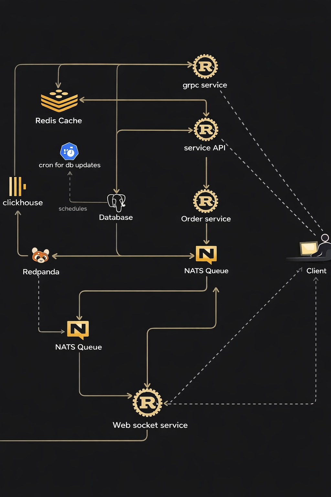
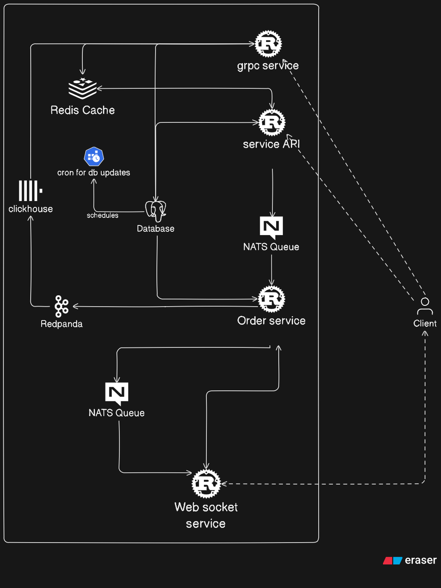
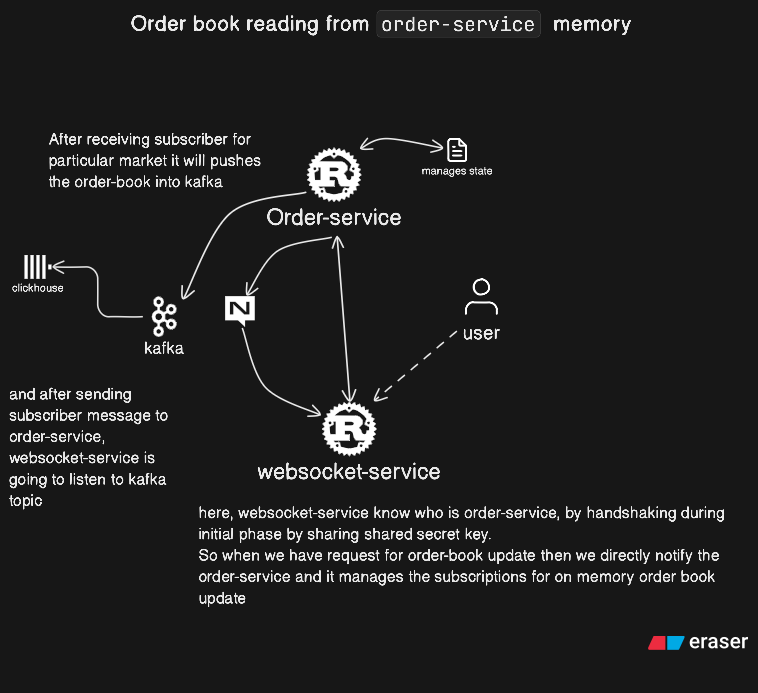
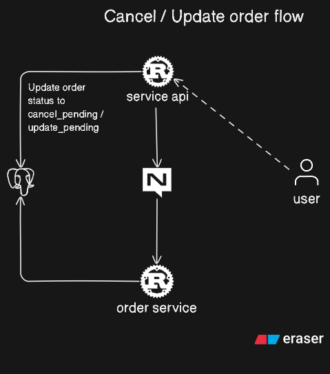

# Prediction Market Platform

A high-performance, distributed prediction market platform built with microservices architecture. This platform enables users to create, trade, and settle prediction markets with real-time order matching, price updates, and comprehensive market analytics.



## Features

- **Real-time Order Matching**: Fast order book management with automatic matching engine
- **Live Price Updates**: Real-time price feeds via WebSocket connections
- **Market Management**: Create, manage, and settle prediction markets
- **User Portfolio**: Track holdings, trades, and transaction history
- **High Performance**: Built with Rust for optimal performance and reliability
- **Scalable Architecture**: Microservices design with message queue-based communication

## Architecture

### System Architecture



### Subsystem Diagrams

#### Order Book Reading Flow


#### Order Operations Flow


## Technology Stack

### Backend Services (Rust)
- **Service API**: RESTful API service with authentication and authorization
- **gRPC Service**: High-performance gRPC service for market and price data
- **Order Service**: Order matching engine with real-time order book management
- **WebSocket Service**: Real-time bidirectional communication
- **Database Service**: PostgreSQL database abstraction layer
- **Auth Service**: JWT-based authentication service

### Infrastructure
- **PostgreSQL**: Primary relational database for transactional data
- **ClickHouse**: OLAP database for analytics and time-series data
- **Redis**: Caching and session management
- **NATS**: High-performance message queue system
- **Redpanda**: Streaming platform for event-driven architecture

### Frontend
- **Next.js 15**: React framework with server-side rendering
- **TypeScript**: Type-safe development
- **Chakra UI**: Component library
- **gRPC-Web**: Client-server communication

### Key Technologies
- **Bloom Filters**: Space-efficient probabilistic data structures for membership testing
- **Protocol Buffers**: Efficient serialization for inter-service communication
- **Docker**: Containerization for development and deployment

## Project Structure

```
├── app/                    # Next.js frontend application
├── auth-service/          # Authentication service
├── db-service/            # Database service layer
├── grpc-service/          # gRPC service for market data
├── order-service/         # Order matching engine
├── service-api/           # REST API service
├── websocket-service/     # WebSocket service
├── proto-defs/            # Protocol buffer definitions
├── utility-helpers/       # Shared utilities
└── docker-compose.yaml    # Development environment setup
```

## Getting Started

### Prerequisites

- Docker and Docker Compose
- Rust (latest stable version)
- Node.js 20+ and npm/yarn/bun
- PostgreSQL client tools (optional)

### Development Setup

1. **Get the project**
   Download or obtain the source and navigate to the project directory.

2. **Start infrastructure services**
   ```bash
   docker-compose up -d
   ```
   This starts PostgreSQL, Redis, NATS, ClickHouse, and Redpanda.

3. **Run database migrations**
   ```bash
   cd db-service
   sqlx migrate run
   ```

4. **Start backend services**
   ```bash
   # Build all services
   cargo build

   # Start services in order (see Service Dependencies below)
   ```

5. **Start frontend application**
   ```bash
   cd app
   npm install
   npm run dev
   ```

### Production Setup

Use the production Docker Compose configuration:

```bash
docker-compose -f docker-compose-prod.yaml up -d
```

## Service Dependencies

Services must be started in the following order due to dependency chains:

```
order-service → websocket-service → grpc-service → service-api
```

Each service depends on the next in the chain, ensuring proper initialization and connection establishment.

## Development Notes

### Message Queue Architecture

NATS supports multiple streams, where each stream acts as a separate queue. Different services use different streams to ensure proper message routing and isolation.

### Frontend Development

The frontend codebase is functional and designed primarily for testing backend services. While not the primary focus of this project, it provides a complete user interface for market interaction.

### Redpanda Commands

Useful commands for working with Redpanda:

- **Consume messages**: `rpk topic consume price-updates -n 10` - Consume the last 10 messages from the `price-updates` topic
- **Seek consumer group**: `rpk group seek consumer-group-price-updates --topics price-updates --to=start --allow-new-topics` - Reset consumer group position to the start of the topic

## API Documentation

### REST API

The service API provides RESTful endpoints for:
- User authentication and management
- Market creation and management
- Order placement and management
- Portfolio and trade history

### gRPC Services

gRPC services are available for:
- Market data queries
- Real-time price updates
- High-performance data retrieval

### WebSocket

WebSocket connections provide:
- Real-time order book updates
- Live price feeds
- Market status notifications

## Contributing

1. Fork the repository
2. Create a feature branch
3. Commit your changes
4. Push to the branch and open a Pull Request

## License

## Support

For issues, questions, or contributions, please open an issue on the repository or contact me via [Telegram](https://t.me/sebasneuron).
